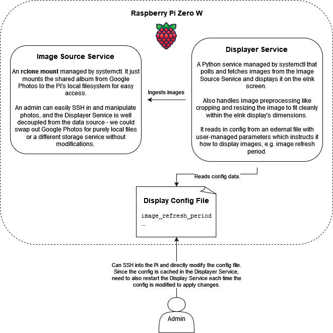
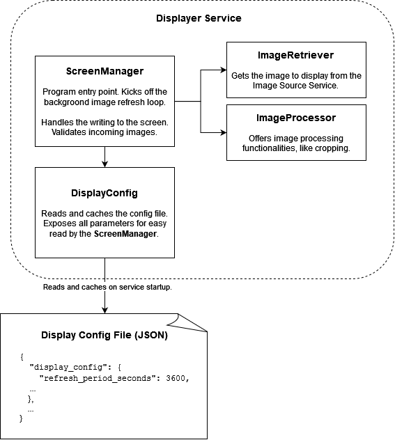
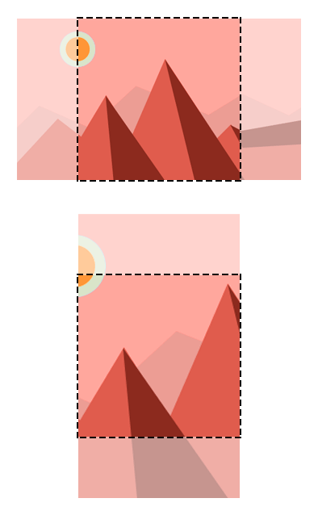
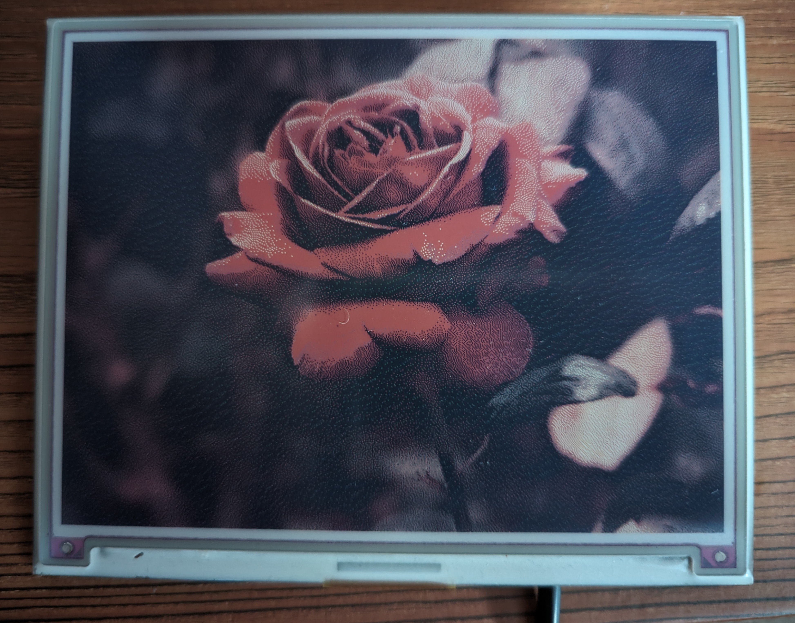

# InkMemories

Ink Memories is a Raspberry Pi eInk project that fetches images from an album in
Google Photos and displays them to the eInk screen.

https://github.com/Tymotex/InkMemories/assets/54927071/7238f156-209b-4a7c-9688-9d730fd1a071

## Table of Contents
- [Components](#components)
- [Usage Notes](#usage-notes)
- [Setup Instructions](#setup-instructions)
- [How it works](#how-it-works)
    - [Google Photos API](#google-photos-api)
    - [Image Processing](#image-processing)
- [Potential Features & Improvements](#potential-features--improvements)

## Components
- Raspberry Pi Zero W and its power supply.
- Inky Impression 5.7" 600x448p (7 colour eInk HAT). [Source](https://shop.pimoroni.com/products/inky-impression-5-7?variant=32298701324371).
- Optional 3D printed stand.

## Usage Notes

Follow the ['Setup Instructions'](#setup-instructions) to set up and begin running Ink Memories on a new Pi zero.

InkMemories will automatically display a new image to the screen every hour.

Using the buttons:
- Press the top left button (labeled 'A') to force refresh a new image.
- Press the second button from the top (labeled 'B') to enter debug mode which displays some logs from the main Python script.
- While in debug mode, press the third button from the top (labeled 'C') to refresh the troubleshooting screen.
    - Note: The troubleshooting screen does not refresh by itself. Real-time updates are not feasible when the eink display used here takes several seconds to refresh.
- Press the bottom left button (labeled 'D') to begin gracefully shutting down the system.
  - Unplug after several seconds to disconnect power.
  - The image will persist on the eInk display indefinitely and without power.
  - Upon reconnecting to power, the system will automatically begin refreshing the image periodically again.

> Beware: disconnecting the Raspberry Pi directly from power can corrupt the SD card. Always click the bottom left button to perform a graceful shutdown before unplugging from power.

- As a one-off operation, you can make the screen display a specific image with:
  `cd displayer_service` and `python display_image.py $IMAGE_FILE_PATH`.
  For example: `python display_image.py test-images/ultrawide-wallpaper.png`.

> Note: This project needs to be run with root privileges in order to headlessly shut down the Pi. Without root privileges, the process will prompt for a password.

- To configure display parameters, such as the time taken between automatic image refreshes, modify `displayer_service/display_config.json`, then reload the displayer service with `sudo systemctl restart ink-memories-displayer` for the config changes to be applied.

## Setup Instructions
These instructions assume that you have set up Raspbian OS.
- In `raspi-config`, enable I2C and SPI. This is necessary for getting the e-ink display to work.
- Set a hostname that you'd like with `cat $NEW_HOSTNAME >> /etc/hostname`.

1. Clone this repo: `git clone https://github.com/Tymotex/InkMemories.git`.
2. Set up Google API credentials.
    Follow Google's [getting started guide](https://developers.google.com/photos/library/guides/get-started#enable-the-api) to:
    1. Set up a new project.
    2. Enable Google Photos API.
    3. Request an OAuth 2.0 client ID. As a result, you'll get a client ID and client secret that you'll need to supply `rclone` later.
3. Run `sudo setup.sh` to be taken through an interactive setup of rclone, and the
   `.service` files to run the Image Source and Displayer services.
    - Set the remote name to `GooglePhotos`.
    - This should start up the Image Source Service and Displayer Service.
      Verify that they work by running:

        ```sh
        sudo systemctl status ink-memories-image-source.service
        sudo systemctl status ink-memories-displayer.service
        sudo systemctl status debug-logs-html-snapshotter.service
        ```

    - Manage Ink Memories with `systemctl`:

        ```sh
        # Kill the service.
        sudo systemctl stop ink-memories-image-source.service
        sudo systemctl stop ink-memories-displayer.service
        sudo systemctl stop debug-logs-html-snapshotter.service
        ```

    - For reference, in my case I supplied these args to setup.sh when it prompted for them:
        ```
        Image source path: /home/pi/Pictures/InkMemories
        Project directory (this repo's root path): /home/pi/InkMemories
        Album name: 🥑🍉
        ```
    
    - After the services are running, an image should be displayed after a minute or two.

4. Run unit tests: `pytest` from the `displayer_service` directory.
5. (Optional) Run the image displayer direcly with `python app.py` in the `displayer_service` directory.


## How it works

In essence, there are two major components:
1. Image Source Service. This is just [`rclone`](https://rclone.org) running as
   a daemon under systemd.
2. Displayer Service. This is a daemon running a Python project,
   `displayer_service`, that handles writing images to the screen, pulling new
   images from the Image Source Service, button presses, etc.

Both are configured to run on system startup.






### Google Photos API

The photos are sourced from a **shared** Google Photos album.

> Note: As of 2023, the free tier permits 10000 requests per day for operations such as uploading images, and 75000 requests per day for reading images. In other words, it's almost certainly enough for this project but may require some image caching on our side to reduce requests for very large albums and very short image refresh periods.

This project does not interact with the Google Photos API directly - instead it
uses [rclone](https://rclone.org/) to connect to the Google Photos API and mount
a photo album to a directory in the local filesystem, making it available to
the displayer service to consume with filesystem semantics. The benefit of this
approach is that displayer service is decoupled from the image service used.
This means it would be easy to swap out Google Photos for other cloud storage
services such as Dropbox or S3, or for local image files.

### Image Processing

Python has a library, [Pillow](https://pypi.org/project/Pillow/), for
manipulating images that this project relies on heavily.

The display used in this project is 600x448p. Ideally, images should have their
aspect ratio preserved while resized to fit into the display. The (imperfect)
solution chosen in this project is to crop the center.

A better solution would be to use AI to pick the best frame to crop from an
image (e.g. one that includes the apparent subject of the photo or the
photographee's faces.)



### Debug Mode

Pressing 'B' will toggle debug mode, showing a troubleshooting screen. Behind
the scenes, a log file is transformed into an HTML file, then the Chromium CLI
is used to take a headless snapshot of that HTML file. Being an HTML file, the
troubleshooting page can be customised with other content, as well as CSS. Since
this project doesn't have too many failure modes, a simple dump of the logs is
all that's displayed here.

The InkyImpressions does not provide native support for displaying HTML files,
so this project introduces a daemon, `debug-logs-html-snapshotter`, that
polls the log file and formats the most recent logs into an HTML file, and takes
a screenshot of it, bounded to the dimensions of the eInk display. (An
improvement to this implementation is to use a file watcher on the log file to
trigger the transformation to HTML instead of polling the log file every few
seconds.)

From the `ScreenManager`'s perspective, the debug screen is created and managed
externally - it simply just depends on it being there and displays whatever is
there.

## Potential Features & Improvements
This was a rushed project. Here are some ideas for how to improve upon the MVP:
- On failure to connect to Google Photos or otherwise, display an error image
  to prompt the user to troubleshoot. Even better, render an HTML page with
  instructions and logs.
- Design a better stand: e.g. one that fits better, secures the display better,
  has engravings, etc.
- Use an AI model to identify photos containing only human faces and display
  only those.
- Embed the image into an HTML page, allowing the freedom to adding HTML/CSS
  customisations. The Inky Impressions library supports the display of HTML
  pages.
    - Idea: Could add in image metadata like the date the photo was taken and
      the location as well as description, if one exists.
- The displayer code doesn't cope well with portrait photos - it takes a central
  crop which works maybe 95% of the time. Use a better framing algorithm.
- Design and deploy a configuration web frontend.
- Photos queueing and rotations (similar to a Spotify music queue and playlist).
- Prevent randomised picking algorithm from re-picking the same photo as last
  time.
- Refresh the countdown for the image refresh when manually invoked.
- Cache photos fetched from Google Photos API (this prevents being bottlenecked by network and should improve performance a lot, *and* it prevents the unlikely situation of hitting Google Photos' free tier quota).
- Clean up tech debt in the codebase and have more exhaustive unit test suites.
- Build and distribute an executable binary instead of directly invoking the Python interpreter. Alternatively, dockerise the project and run these services as containers.
- Improve the setup script:
    - Skip steps.
    - Arg validation and confirmation prompts.


